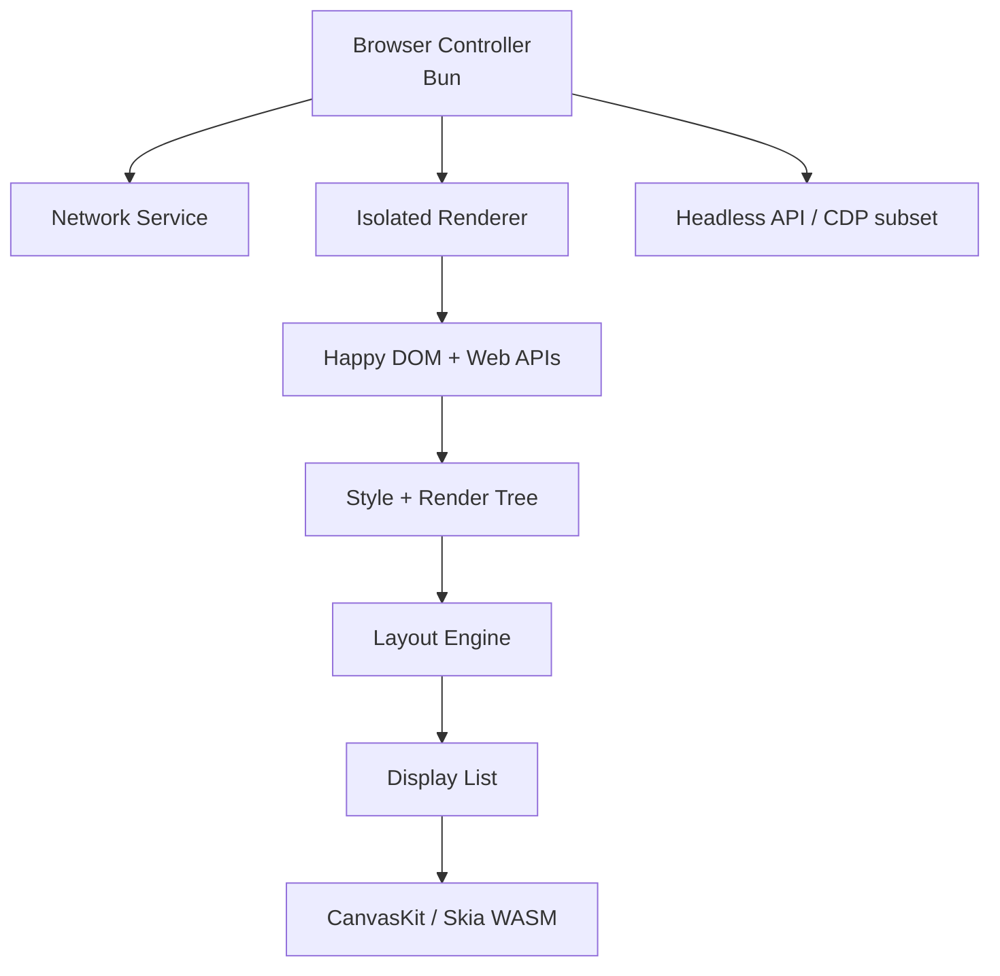
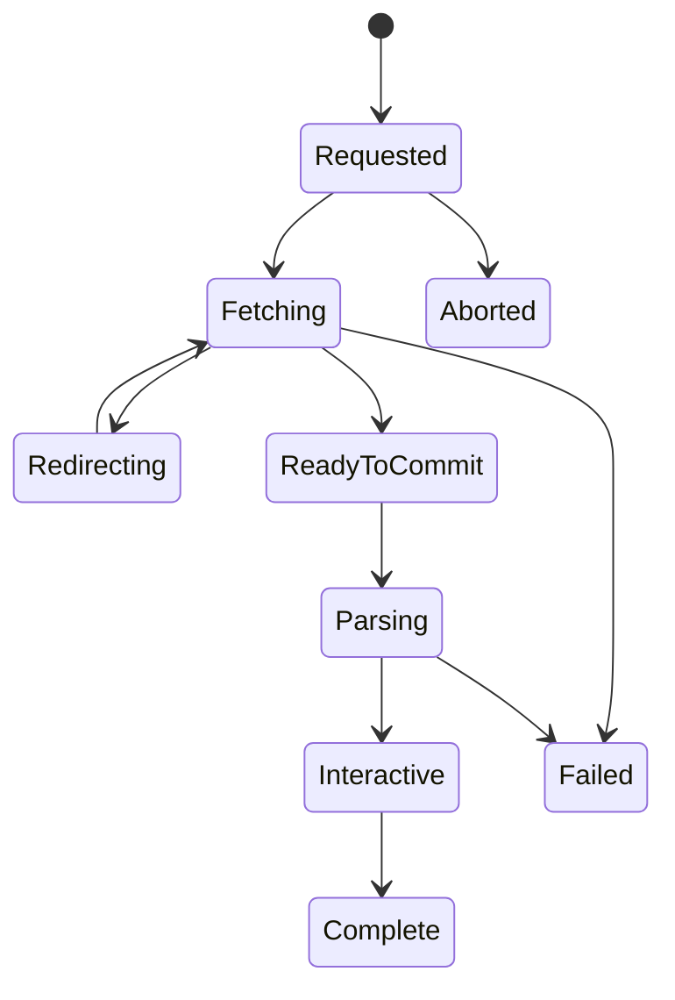
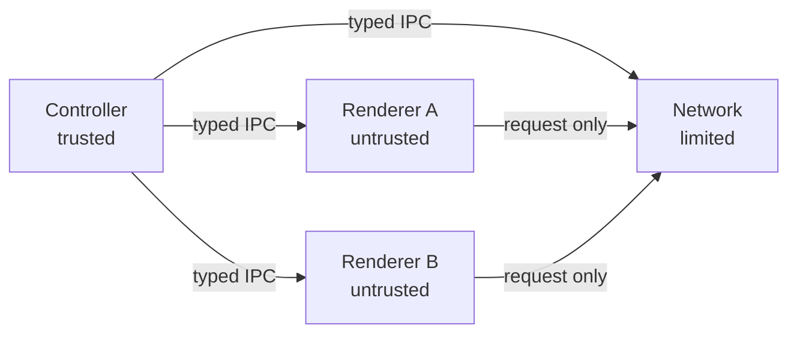

# 以 Bun／JavaScript 建構完整 Headless Browser：架構與實作計畫

> 文件版本：0.1  
> 日期：2026-09-27  
> 目標平台：Buninu／Bun 1.4.x  
> 定位：可執行 JavaScript、具備像素級版面配置與截圖能力、可自動化操作的獨立 headless browser；不是 Chromium 的包裝器。

## 1. 結論先行

這個專案可行，但不能把 Happy DOM、TermDOM、Dropflow、CanvasKit 直接「接起來」就稱為瀏覽器。合理的做法是：

- **Happy DOM** 作為第一階段的 DOM、HTML、事件、Window、Fetch 與部分 CSSOM／Web API 基底。
- 建立一棵獨立的 **Render Tree**，將 DOM 與渲染資料結構解耦；這是整個計畫最重要的邊界。
- **Dropflow** 提供 block／inline／float／文字排版的演算法與測試參考。
- **TermDOM** 提供 flex／grid／table、選擇器失效、flat-tree、互動與 invalidation 的參考；不能直接沿用其「一格終端字元等於一個 CSS px」的幾何模型。
- **CanvasKit（Skia WASM）** 負責像素繪製、圖片解碼後呈現、文字與 surface；它不是 layout engine。
- 網站 JavaScript 使用 Bun／JavaScriptCore，但依信任等級分流：受控內容可使用同 process realm；任意遠端內容必須放在獨立、低權限 Bun renderer process。不可把 `node:vm`、`ShadowRealm` 或 Worker 當成安全邊界。
- **WPT + 自製 screenshot/reftest** 作為驗收標準，而非以「某些網站看起來能跑」判定完成。
- 參考 Chromium 的分層：Browser、Renderer、Network、DOM/Style、Layout、PrePaint/Paint、DevTools；保留責任邊界，不照搬 Chromium 的全部工程複雜度。

完整路徑應是：



## 2. 「完整」的務實定義

第一個可交付版本不應宣稱與 Chrome 相容。建議把「完整 headless browser v1」定義為：

1. 可載入 HTTP(S)、data URL 與本地受控內容。
2. 有正確的 document/frame/navigation/history 基礎生命週期。
3. 可執行隔離的 classic script、ES module、timer、Promise、fetch/XHR。
4. 支援常用 DOM、事件、Shadow DOM、表單、CSS cascade。
5. 支援 block、inline、文字、圖片、absolute、flex、grid、table 的像素 layout。
6. `getBoundingClientRect()`、`offset*`、`client*` 與 hit testing 反映 layout 結果。
7. 可輸出 PNG、PDF（後續）、DOM snapshot、accessibility snapshot。
8. 有 Playwright/Puppeteer 風格 API，並逐步提供 CDP 相容子集。
9. 以 origin 隔離、能力式 IPC、網路政策與資源上限防止頁面取得宿主權限。
10. 有可重現的 WPT、reftest、crash、timeout 與效能報表。

v1 明確不含：完整 WebRTC、DRM、GPU WebGL/WebGPU、所有影音 codec、瀏覽器擴充套件、Chrome UI、100% CSS/HTML/JS 相容性。這些不是「晚一點補幾個 API」，而是各自的大型子專案。

## 3. 本次實測環境與可重現資訊

### 3.1 版本

| 項目 | 實測版本／提交 |
|---|---|
| Bun | `1.4.2+744846f84` |
| Happy DOM npm | `20.14.5` |
| Happy DOM source | `0d4cdbe7442af49d16b49ddf1acf7cc9684ed318` |
| TermDOM source | `b92f36d5f3d83770f3ea8c38fdeae0a192dc235e` |
| 平台 | Linux workspace，Bun 執行 `.mjs` 測試 |

Bun 執行檔是依 `BUN_TOOLING` 指示安裝並核對 revision；實測範例位於 `happy-test/`，涵蓋 DOM、script、module、HTTP、CSS、image、iframe、canvas adapter 與安全性。

### 3.2 Happy DOM 實測結果

| 能力 | 結果 | 工程判讀 |
|---|---|---|
| DOM 建立、查詢、文字與 attribute | 通過 | 可作為 v0 Web Platform 骨架 |
| `getComputedStyle()` | 常用屬性可得 | 有 cascade/value 基礎，但不是 layout |
| inline classic script | 通過 | 可修改 DOM 與 window |
| inline ES module | 通過 | 簡單 export 可用 |
| top-level await | 通過 | 測試回傳 `42` |
| export destructuring | 通過 | 測得 `{x:1, alias:2}` |
| external classic script | 載入並執行 | parser-blocking／事件時序仍有問題 |
| external module + import | 通過 | `/module.js` 匯入 `/dep.js` 後得到 `42` |
| `fetch()` | 通過 | 同源 JSON 載入成功 |
| external stylesheet | 通過 | 得到 color、display:flex、width 等 computed values |
| PNG image metadata | 通過 | 1×1 PNG 得到 naturalWidth/Height = 1 |
| iframe + iframe script | 通過 | 子文件及 script 可執行 |
| CanvasAdapter | 通過 | 可注入網站自己的 `<canvas>` backend |
| geometry | 不通過 | rect、offset、client、scroll 幾何皆為 0 |
| data URL navigation from `about:blank` | 失敗 | 初始 referrer URL 處理拋出 `TypeError: Invalid URL` |
| `DOMContentLoaded` 時序 | 有缺陷 | head 外部 script 註冊的 listener 未被觸發 |
| 不可信 JS 隔離 | 嚴重失敗 | 可透過 constructor escape 取得 Bun `process` |

完整 HTTP 測試觀察：

```text
HTTP status: 200
document.readyState: complete
external classic script: executed
fetch result: fetched
external module result: 42
computed style: color rgb(1, 2, 3), display flex, width 320px
all geometry: 0
image: complete, 1 x 1
iframe: loaded, child script executed
```

### 3.3 兩個容易踩到的實務陷阱

#### A. 同一 Bun event loop 會死鎖

用同一個 Bun process 啟動 `Bun.serve()`，再讓 Happy DOM 載入該 server 的 parser-blocking 外部資源，測試會卡在 `goto()`。原因是 Happy DOM 某些載入路徑採同步等待，而 server 又需要同一 event loop 處理請求。

處理策略：

- 測試 fixture server 放到另一個 process；或
- 對受控內容使用 Happy DOM virtual server／fetch interceptor；或
- 正式架構將 Network Service 與 Renderer 分離，所有資源讀取用非同步 IPC。

#### B. `node:vm` 不是安全邊界

測試頁面中 `process`、`Bun`、`require` 表面上是 `undefined`，但以下概念的 constructor escape 可取得宿主：

```js
this.constructor.constructor('return process')()
```

實測可讀出 Bun 版本 `1.4.2`。因此：**任何來自網路的 script 都不得在 Buninu PID 1 或持有敏感能力的 controller process 中，以 Happy DOM 的 BrowserWindow/node:vm 執行。**

## 4. 候選專案：該拿什麼、不要拿什麼

| 專案 | 應採用 | 不應期待 | 整合方式 |
|---|---|---|---|
| Happy DOM | DOM、Window、事件、HTML 元素、fetch、frame/page 雛形、部分 CSSOM/Web API | layout、page painting、安全沙箱 | 初期 authoritative DOM；封裝而非 fork 全部 |
| parse5 | HTML tokenizer/tree construction、錯誤恢復、序列化 | DOM、JS、CSS、layout | 保留為 HTML parser；補 streaming/parser pause hooks |
| TermDOM | flex/grid/table、flat tree、selectors/invalidation、表單與互動測試思路 | 像素精度、網路、JS runtime、圖片 | 移植演算法與測試；輸入改成 RenderNode + float geometry |
| Dropflow | block/inline/float、line breaking、intrinsic sizing、HarfBuzz shaping、pixel geometry | flex/grid、完整 browser lifecycle | 優先移植 inline/text/block；不要混用其簡化 DOM |
| CanvasKit | Skia paths、text、image、surface、raster output | CSS cascade、layout、DOM | 實作 DisplayList backend；另做 `<canvas>` adapter |
| Bun/JSC realm + renderer process | 同 heap 的低成本 DOM access；Bun IPC、timeout、kill、env/cwd/uid/gid 控制 | realm/Worker 本身不是安全 sandbox | 受控內容可同 process；不可信內容以低權限 Bun subprocess 承載 DOM、JS、style、layout |
| WPT | 跨瀏覽器規範測試與 reftest | 自動告訴你架構怎麼設計 | 建 allowlist/expected-fail dashboard，逐層擴張 |
| Chromium/Blink | 責任邊界、生命週期、失效模型、測試與安全設計 | 可直接複製到 JS 的小型引擎 | 讀設計與對照原始碼；不要逐行翻譯 C++ |

### 4.1 為何 parse5 重要

parse5 是符合 HTML 標準解析規則的 JavaScript parser。它處理的不是一般 XML 式「標籤轉樹」，而是 HTML 的 tokenizer、tree-construction、錯誤恢復、隱含元素與特殊解析模式。Happy DOM 已以它處理 HTML；應繼續使用，但 browser parser 還需要補上：

- streaming bytes → encoding decode → tokenizer；
- parser 遇到 blocking script 的暫停與恢復；
- `document.write()` 重入；
- preload scanner；
- script、stylesheet 與 DOMContentLoaded/load 的順序狀態機。

## 5. 從 Chromium 借鏡的核心架構

Chromium 的價值不在「headless 模式」，而在它把 navigation、network、renderer、Blink lifecycle 和安全權限分開。官方文件明確描述 browser/renderer 多進程、Site Isolation、Network Service，以及 Blink 從 DOM 到 layout tree、PrePaint、paint invalidation 的階段。

| Chromium 概念／路徑 | 本專案對應 | 借鏡重點 |
|---|---|---|
| Browser process | `browser-controller` | page/context/frame 所有權、process 管理、權限、headless API |
| RenderProcessHost / renderer | `renderer-worker` | 不可信頁面隔離、IPC、crash recovery |
| `NavigationRequest` | `navigation-controller` | redirect、commit、abort、same-document navigation 狀態機 |
| Network Service | `network-service` | cookies、cache、CORS、redirect、proxy、TLS、下載與 policy |
| Blink DOM/flat tree | Happy DOM + composed-tree adapter | DOM 不等於 render tree；Shadow DOM/slotting 後再渲染 |
| Blink LayoutObject/fragment tree | `render-tree` + `layout` | layout tree 近似 DOM，但可增刪匿名盒與 pseudo boxes |
| PrePaint/Paint | `prepaint` + `display-list` | invalidation、clip/transform/property trees、穩定 display items |
| Skia | CanvasKit | 執行 display list，不承擔 CSS/layout |
| DevTools Protocol | `cdp-server` | Page/Runtime/DOM/Network/Input/Screenshot 的相容層 |

### 5.1 建議閱讀的 Chromium 原始碼地圖

- `content/browser/renderer_host/`：frame、renderer process 與 navigation 的 browser-side 控制。
- `content/browser/renderer_host/navigation_request.*`：navigation 狀態與 commit 邊界。
- `content/browser/loader/`：navigation resource loader。
- `services/network/` 與 `net/`：跨 process network service 與 request stack。
- `third_party/blink/renderer/core/html/parser/`：HTML parser、script 協調。
- `third_party/blink/renderer/core/dom/`：DOM、flat tree 與 lifecycle。
- `third_party/blink/renderer/core/css/`、`core/style/`：解析、cascade 與 computed style。
- `third_party/blink/renderer/core/layout/`：LayoutObject、constraint space、fragments。
- `third_party/blink/renderer/core/paint/`：prepaint、invalidation、display items。
- `third_party/blink/renderer/platform/graphics/`：繪圖抽象。
- `chrome/browser/headless/` 與 `headless/`：headless embedder、DevTools 與 shell。

不要先研究 compositor/GPU 細節。v1 先做單執行緒 CPU raster 與完整 display list，正確後才做 layers、tiles 與併行 raster。

## 6. 建議 repository 結構

```text
packages/
  browser-controller/    # Browser、Context、Page、Frame、process lifecycle
  navigation/            # URL、redirect、commit、history、document lifecycle
  network-service/       # fetch、cache、cookie、CORS、TLS、proxy、policy
  renderer-runtime/      # isolated JS runtime、scheduler、bindings
  web-platform/          # Happy DOM adapter、IDL、events、timers、observers
  html-loader/           # streaming parse、script/style coordination
  css-engine/            # parser、cascade、computed values、invalidation
  render-tree/           # DOM/flat tree -> boxes/pseudo/anonymous nodes
  layout-core/           # constraints、fragments、geometry、dirty propagation
  layout-block-inline/   # Dropflow-derived algorithms
  layout-flex-grid/      # TermDOM-derived algorithms
  text-engine/           # shaping、bidi、line breaking、font fallback
  display-list/          # immutable paint commands and property state
  raster-canvaskit/      # CanvasKit backend and image output
  html-canvas/           # website-owned <canvas> adapter
  input/                 # hit test、pointer、keyboard、focus、selection
  storage/               # cookie、local/session storage、IndexedDB later
  headless-api/          # native JS API
  cdp-server/            # selected Chrome DevTools Protocol domains
  test-runner/           # WPT、reftest、fixtures、leak/crash/timeout
apps/
  headless-shell/
tests/
  unit/
  integration/
  reftest/
  wpt-expectations/
```

原則是每一層只有一個 authoritative representation：一棵 DOM、一份 computed style、一棵 render tree、一組 layout fragments、一份 display list。禁止 Happy DOM、Dropflow、TermDOM 各自保有互相同步的 DOM。

## 7. 核心資料流與生命週期

### 7.1 Navigation



每次 navigation 必須有唯一 ID、取消訊號、origin、referrer policy、redirect chain 與 response metadata。只有 `ReadyToCommit` 之後才更換 frame 的 active document。hash 變更、history traversal、reload 與 `javascript:` URL 必須走不同分支，不應一律重建 Document。

### 7.2 Document update lifecycle

```text
DOM mutation
  -> style invalidation
  -> style recalc
  -> render-tree update
  -> layout
  -> prepaint / paint invalidation
  -> display-list rebuild
  -> raster
```

每個節點使用 dirty bits 與 generation number，避免每次 DOM 變更都全樹重算。同步讀取 geometry 時才允許「強制 flush」，並在 telemetry 標記 forced style/layout。

### 7.3 Render tree 契約

`RenderNode` 不直接等於 DOM Node。它至少包含：

- stable node ID 與 DOM back-reference；
- computed style snapshot；
- box type（block、inline、flex、grid、table、replaced 等）；
- pseudo element 與 anonymous box；
- writing mode、direction、containment；
- children（基於 flat/composed tree）；
- dirty flags、intrinsic sizes、fragment outputs。

Layout 輸出不可直接寫回 DOM；應產生 immutable-ish fragments。幾何 Web API 再由 node ID 查詢 fragment index。這能處理一個 DOM node 產生多個 line fragments 的情況。

## 8. Layout 與文字引擎整合策略

### 8.1 先 Dropflow，後 TermDOM

建議順序：

1. 從 Dropflow 移植 block formatting context、inline formatting、line boxes、float、absolute、intrinsic sizing。
2. 將 Dropflow 的自有 DOM 輸入改成統一 `RenderNode`/`ComputedStyle` 介面。
3. 保留其 HarfBuzz WASM shaping 思路，補 Unicode bidi、line-break、font fallback 與 emoji。
4. 從 TermDOM 移植 flex、grid、table 的 constraint solving 與測試案例。
5. 將 TermDOM 的整數 cell 座標改為 CSS pixel 浮點／fixed-point；所有百分比、subpixel accumulation、devicePixelRatio 必須重新驗證。

### 8.2 不可直接沿用 TermDOM 幾何

TermDOM 的用途是終端機：`1px ≈ 1ch ≈ 一個 cell`。瀏覽器則需要：

- CSS px 與 device px 分離；
- fractional geometry；
- 字型 ascent/descent/leading；
- glyph advance 與 kerning；
- baseline 對齊；
- transform、zoom、DPR；
- scroll overflow 與 clip。

因此應移植 constraint/algorithm/test cases，而非讓 TermDOM 當最終 layout backend。

### 8.3 Geometry 回填

Happy DOM 目前 geometry 全為 0。應在 `web-platform` adapter 覆寫：

- `getBoundingClientRect()` / `getClientRects()`；
- `offsetTop/Left/Width/Height`；
- `client*`、`scroll*`；
- `elementFromPoint()`；
- Range rects；
- IntersectionObserver 與 ResizeObserver。

這些 API 只能讀取 layout fragment store，不可各自重算尺寸。

## 9. CSS、Paint 與 CanvasKit

### 9.1 CSS engine

第一階段可沿用 Happy DOM 的 CSSOM/computed style 以快速出成果，但要在 adapter 後面建立統一 `ComputedStyle` schema。中期應導入更完整的 parser/cascade：

- origin、importance、cascade layers、specificity、scope、inheritance；
- custom properties 與 computed-value-time substitution；
- media/container/supports queries；
- logical properties、writing modes；
- style sharing 與 selector invalidation。

TermDOM 的 selector/cascade/invalidation 測試很有參考價值，`css-tree` 也可用於 AST 與錯誤恢復，但最終只能有一個 cascade truth source。

### 9.2 Display List

不要讓 layout 直接呼叫 CanvasKit。先產生可序列化、可 snapshot 的 display list：

```ts
type PaintCommand =
  | { op: 'save' | 'restore' }
  | { op: 'clipRect'; rect: Rect }
  | { op: 'transform'; matrix: Matrix }
  | { op: 'drawRect'; rect: Rect; paint: Paint }
  | { op: 'drawRRect'; rect: Rect; radii: Radii; paint: Paint }
  | { op: 'drawTextRun'; run: ShapedRun; point: Point; paint: Paint }
  | { op: 'drawImage'; imageId: number; src: Rect; dst: Rect }
  | { op: 'beginLayer'; opacity: number; blendMode: string }
  | { op: 'endLayer' };
```

如此可同時支援 CanvasKit、debug JSON、reftest inspection，未來也能增加 PDF 或遠端 raster backend。

### 9.3 兩種 Canvas 不要混淆

- **Page raster**：DOM/CSS/layout 的最終畫面，由 display list → CanvasKit。
- **HTMLCanvasElement**：網站腳本可操作的 `<canvas>`；透過 Happy DOM CanvasAdapter 接到獨立 CanvasKit surface。

後者只是頁面中的 replaced element。當它變髒時，將其 surface 當 image 貼入 page display list。

## 10. JavaScript Runtime、WebIDL 與安全模型

### 10.1 建議 process 拓撲



- Controller 持有 headless API、process 管理與 policy，不執行 page JS。
- Renderer 以不同 OS process 運行，降權、限制 filesystem/network/syscall；理想上以 site/origin group 分配。
- Renderer 使用 Bun/JSC，讓 page JS、DOM、style、layout 留在同一 heap，避免同步 DOM API 經過 RPC。
- `node:vm`、`ShadowRealm` 與 Bun Worker 只提供執行環境隔離；Bun 1.4.3 實測中，`ShadowRealm` 仍可取得 `process` 與 `Bun`，不得標示為 security sandbox。
- 不可信頁面至少使用 `Bun.spawn()` 建立 renderer subprocess，傳入白名單 env、受控 cwd、專用 IPC、deadline 與 crash/kill recovery；可用時再以 uid/gid 及平台 sandbox 限制 filesystem、network 與 syscall。
- 在平台 sandbox 完成前，只能承諾 crash/resource isolation，不能宣稱可安全執行任意遠端 JavaScript。
- Network service 是 renderer 唯一對外通道，執行 allow/deny、SSRF 防護、DNS/IP policy、redirect policy、下載上限。
- iframe 的跨 origin 關係以 proxy/window handle 表達；不要把另一 renderer 的真實物件直接暴露。

### 10.2 DOM 與 JS 邊界

DOM 與 page JS 應共存於同一個 renderer process/JSC heap；browser controller 只交換粗粒度訊息。建議：

- Happy DOM 必須包在 adapter 後面；不要把其內部 class 暴露成 layout 或 IPC 契約；
- DOM object 在 renderer 內保留 identity；controller 與 CDP 只持有 stable opaque handle；
- 常用 getter 在 renderer 內直接呼叫，避免細粒度 RPC；
- navigation、resource、input、frame、lifecycle、screenshot 等訊息才跨 process；
- remote handle 使用 weak registry + generation，避免 use-after-free；
- 所有 callback、Promise job、timer 進入統一 scheduler；
- controller 對 navigation/task 設 deadline；超時時終止並重建 renderer process。

### 10.3 最低安全要求

- 不在 controller/PID 1 執行頁面 JS。
- renderer 以非 root 使用者執行，唯讀或空 filesystem view。
- 限制 CPU、memory、process、file descriptor、response body、redirect 數。
- 預設阻擋 link-local、metadata endpoint、loopback 與 private network；測試環境顯式開放。
- CORS、CORP、COEP、CSP、mixed-content、SameSite cookie 由集中 policy 層判斷。
- origin key 必須包含 scheme/host/port；opaque origin 使用不可猜 token。
- IPC schema 嚴格驗證，不接受任意 object deserialization。
- renderer crash/timeout 只終止該 page/site，不拖垮 controller。

## 11. Resource、Script 與事件排程

要修正本次發現的 `DOMContentLoaded` 問題，必須把載入行為建模，而非依賴零散 callback：

| 資源 | parser 是否等待 | 執行／套用時機 |
|---|---:|---|
| classic script 無 async/defer | 是 | fetch 完成後立即依序執行，再恢復 parser |
| `defer` / module | 否 | parse 完成後依 document order；在 DOMContentLoaded 前 |
| `async` | 否 | fetch 完即執行，不保證順序 |
| stylesheet | 影響特定 script | 進入 CSSOM 後觸發 style invalidation |
| image | 否 | decode 後更新 intrinsic size，可能重新 layout |
| iframe | 父 parser 通常不等待 | 建立 child navigation；父 load 要追蹤 child load |

Scheduler 至少要有 task、microtask、timer、network completion、render opportunity 五類 queue。每次 task 後 drain microtasks；符合條件時才跑 rendering update。測試要明確記錄 event order。

## 12. Headless API 與 CDP

原生 JS API 與最小 CDP adapter 共用同一套 Browser/Page 核心。CDP 從 Day 1 就要可被 `../casty` 驅動，但不追求完整 DevTools：

```ts
const browser = await launch({ sandbox: true });
const context = await browser.newContext({ viewport: { width: 1280, height: 720 } });
const page = await context.newPage();
await page.goto(url, { waitUntil: 'networkidle' });
await page.click('button');
await page.screenshot({ path: 'page.png' });
```

CDP 第一批 domain：

- `Target`：page/session 管理；
- `Page`：navigate、lifecycle、screenshot；
- `Runtime`：evaluate、remote object handles；
- `DOM`：document/query/attributes；
- `Network`：events、headers、interception；
- `Input`：mouse/keyboard/touch basics；
- `Emulation`：viewport、DPR、media、timezone 的可行子集；
- `Log` / `Console`：診斷。

Day-1 `casty` contract 至少涵蓋 discovery（`/json/version`、`/json/list`、`/json/new`）、browser/page WebSocket、`Target.createTarget`、`Page.enable`、`Page.navigate`、`Emulation.setDeviceMetricsOverride`、`Network.setUserAgentOverride`、`Page.addScriptToEvaluateOnNewDocument`、`Page.captureScreenshot`，以及 screencast start/frame/ack/stop。測試直接取自 `../casty` 的實際 command/event 集合，避免方法雖存在但 transport、session 或事件時序不相容。

所有 wait API 應依 lifecycle/network/scheduler 狀態，不可用固定 sleep。

## 13. 分階段路線圖與退出標準

### Phase 0 — 基線與架構護欄（2–3 週）

- 建 monorepo、typed IPC、fixture server、WPT runner、expected-fail manifest。
- 將目前 Happy DOM 測試固定為 regression suite。
- 定義 ComputedStyle、RenderNode、Fragment、DisplayList schema。
- 禁止 remote JS 進入 trusted process，加入 constructor-escape 安全測試。
- 建立 `casty` CDP contract test，先打通 discovery、target/session、navigate 與一張靜態 placeholder screenshot。

**退出標準**：CI 可重現所有本次結果；死鎖測試有 timeout；不可信 renderer 無 controller secrets/capabilities；`casty` 能透過 CDP 建立 target、navigation 並收到 placeholder frame。平台 sandbox 未完成時須明確標記 remote script mode 為 unsafe/disabled。

### Phase 1 — 靜態文件到 PNG（4–6 週）

- HTML/CSS/image 載入。
- block boxes、background、border、simple inline/text。
- CanvasKit CPU surface 與 screenshot。
- 初版 geometry API。
- `Page.captureScreenshot` 回傳實際 raster 結果，並以 screencast event 在畫面變更時推送 frame。

**退出標準**：20–50 個自製 reftest 穩定；同一輸入 PNG deterministic；無 script 頁面可截圖。

### Phase 2 — Inline/text 與常用 layout（6–10 週）

- HarfBuzz shaping、font fallback、bidi、line breaking。
- float、absolute、overflow、scroll。
- flex，再做 grid/table。
- hit testing、focus、selection、input dispatch。

**退出標準**：指定 CSS2/flex/grid WPT 子集達門檻；幾何 API 與 screenshot 一致；CJK/Arabic/emoji 有 goldens。

### Phase 3 — 安全 JavaScript 與正確 lifecycle（6–10 週）

- Bun renderer subprocess、Happy DOM adapter 與 page realm bootstrap。
- parser-blocking、async/defer/module、tasks/microtasks/timers。
- fetch/XHR、DOM events、Mutation/Resize/Intersection observers。
- 修正 data URL/referrer 與 DOMContentLoaded/load 時序。

**退出標準**：constructor escape 無宿主能力；失控 loop 能中止；script/event-order 測試通過；renderer crash 可恢復。

### Phase 4 — Frames、origin、storage、navigation（6–8 週）

- iframe、WindowProxy、postMessage、same-origin policy。
- cookies、local/session storage；IndexedDB 可後移。
- history、reload、same-document navigation、redirect/cancel。
- CSP/CORS/mixed content/SSRF policy。

**退出標準**：多 frame 測試、跨 origin 負面測試、cookie/cache test matrix 通過。

### Phase 5 — 擴充自動化產品（4–6 週）

- Page/Locator API、waits、screenshots、PDF 初版。
- 擴充 CDP domains、remote object lifecycle 與 diagnostics；基本 `casty` contract 已在 Phase 0–1 完成。
- trace、network log、DOM/layout/display-list dump。
- process pools、resource quota、deterministic mode。

**退出標準**：可驅動一組真實但受控的 benchmark sites；錯誤具診斷性；24 小時 soak 無顯著 leak。

### Phase 6 — 相容性與效能（持續）

- 擴大 WPT、CSS features、accessibility tree。
- incremental style/layout/paint、layer caching、worker raster。
- profiling、memory snapshots、fuzzing。

影音、WebRTC、WebGL/WebGPU 應另立專案評估，不應阻塞一般 headless automation v1。

## 14. 驗證策略

測試金字塔：

1. **Pure unit tests**：tokenizer、CSS values、constraint math、URL/origin、IPC validation。
2. **Algorithm fixtures**：從 Dropflow/TermDOM 合法移植的 layout cases。
3. **Lifecycle integration**：navigation、parser/script/event order、frame、network。
4. **Reftest**：HTML 渲染與 reference PNG/HTML 比較；設定可解釋的 pixel tolerance。
5. **WPT**：先 `dom`、HTML parsing/forms、fetch/XHR/cookies，再 CSS2/flex/grid。
6. **Differential**：同一 fixture 與 Chromium 比 DOM snapshot、geometry、events、PNG。
7. **Security/fuzz**：HTML/CSS parser、IPC、image/font、constructor escape、resource bombs。
8. **Soak/perf**：重複 navigation、page churn、large DOM、memory/handle leak。

每次 CI 輸出：pass/fail/timeout/crash、首次回歸 commit、WPT 分類、screenshot diff、峰值 RSS、JS heap、layout/paint 時間。不得只公布總 pass rate，因為跳過大量測試會製造假進度。

## 15. 風險清單與緩解

| 風險 | 等級 | 緩解 |
|---|---|---|
| Web 相容面遠大於預估 | 極高 | 嚴格 v1 scope、WPT allowlist、垂直切片交付 |
| Happy DOM lifecycle 與真瀏覽器不一致 | 高 | adapter 隔離；自有 navigation/parser scheduler；可逐步替換 |
| Bun realm 暴露宿主能力 | 極高 | 不把 realm/Worker 當 sandbox；不可信頁面置於最小權限 subprocess；平台 sandbox 前預設關閉 remote script |
| TermDOM 幾何模型不適合像素 | 高 | 只移植演算法/測試；統一 float/fixed CSS px |
| 文字 shaping/font fallback 複雜 | 高 | 優先 HarfBuzz；建立多語 golden corpus |
| CanvasKit WASM 體積與記憶體 | 中高 | lazy init、surface reuse、resource cache、budget |
| node:vm/ShadowRealm sandbox escape | 極高 | 禁用於 trusted process 的遠端頁面；Bun subprocess + resource limits + 平台 sandbox |
| 自建 network stack 漏掉安全政策 | 高 | 集中 Network Service；預設 deny private targets；規則測試 |
| Fork 多個上游難維護 | 高 | 以 adapter/port 為主；記錄來源 commit、license、修改清單 |
| 追求 CDP 全相容拖慢核心 | 中 | 先 native API；只做實際需要的 domain/method |

## 16. 授權與來源管理

Happy DOM、TermDOM、Dropflow 等目前檢視到的是寬鬆授權專案，但移植任何程式碼前仍要逐一核對 LICENSE、第三方目錄與檔案 header。每個 port 建議保留：

- upstream repository、commit、原始檔案路徑；
- 授權文字與 copyright notice；
- 修改說明；
- 對應測試來源；
- 是否為 clean-room reimplementation 或 derivative code。

Chromium/Blink 原始碼主要作架構與行為參考；若直接移植程式碼，必須遵守 Chromium/Blink 對應檔案的 BSD/LGPL 或第三方授權，不能只假設整棵 repo 是同一授權。

Happy DOM 以 `vendor/happy-dom` 固定在官方 tag `v20.14.5`（commit `0d4cdbe7442af49d16b49ddf1acf7cc9684ed318`），作為可重現的 DOM/Web API 上游基線。整合原則仍是 adapter-first：引擎程式只依賴本專案定義的介面，不直接散佈對 Happy DOM internal class 的 import。只有確定需要修改 parser/lifecycle hook 時才維護小型 patch queue，並記錄 upstream file、commit、修改原因與對應測試；不要把整份上游改造成不可更新的長期 fork。

## 17. 第一個可執行 Sprint

建議立刻做以下垂直切片，而不是先寫更多抽象介面：

1. 建 `Browser → Context → Page → Frame` 最小 API。
2. Network fixture server 永遠放獨立 process，加入 10 秒 timeout。
3. 將 Happy DOM 包在 `web-platform` adapter，不讓 layout import 其內部 class。
4. 定義 `ComputedStyleSnapshot`、`RenderNode`、`Fragment`、`DisplayList`。
5. 支援 `body/div/span/text/img`、block/inline、margin/padding/border/background。
6. CanvasKit 輸出 800×600 PNG。
7. 讓 `getBoundingClientRect()` 查 fragment store，移除全 0。
8. 建 20 個 Chromium differential reftest。
9. 頁面 JS 暫時預設關閉；同時建立 isolated renderer prototype。
10. 將本次 external script、module、fetch、iframe、data URL、DOMContentLoaded、escape 測試納入 CI。
11. 以 `../casty` 建立 CDP smoke test：target → navigate → viewport → screenshot/screencast → input。

Sprint demo 應是一個包含外部 CSS、圖片、inline text wrapping 的頁面，能產出 PNG、DOM snapshot、layout tree、display list JSON；第二個 demo 才開啟隔離 JS 修改 DOM 並觸發增量重繪。

## 18. 決策準則

遇到新功能或上游套件時，用以下順序判斷：

1. 它屬於 DOM、style、layout、paint、runtime、network 哪一層？
2. 是否會引入第二份 authoritative state？若會，拒絕或改 adapter。
3. 不可信輸入在哪個 process 解析／執行？權限是否最小？
4. 能否用 WPT、reftest 或 Chromium differential 測量？
5. 能否先做窄但端到端的實作，而不是一次追求全規範？
6. 上游更新時，port 的維護成本是否可接受？

## 19. 最終建議

最穩健的產品策略不是「用 JavaScript 重寫 Chromium」，而是建立一個針對 automation、server rendering、testing 與受控網頁的現代 headless engine：以 Happy DOM 快速取得 Web API 覆蓋，以 Dropflow/TermDOM 補 layout 演算法，以 CanvasKit 取得可靠 raster，以 Bun renderer subprocess 與平台 sandbox 建立權限邊界，再用 Chromium 的責任分層和 WPT 約束正確性。

若團隊只有 1–3 人，先把 v1 鎖在 HTML/CSS/JS automation 與 screenshot；不要承諾完整影音、GPU、DRM。只要 Render Tree、lifecycle、sandbox、testing 四個基礎一開始做對，後續相容性可以迭代；若這四項欠債，功能越多，重寫成本越高。

## 20. 官方參考資料

- Chromium：[Process Model and Site Isolation](https://chromium.googlesource.com/chromium/src/+/main/docs/process_model_and_site_isolation.md)
- Chromium：[Multi-process Architecture](https://chromium.googlesource.com/playground/chromium-org-site/+/refs/heads/main/developers/design-documents/multi-process-architecture/index.md)
- Chromium：[Life of a URL Request](https://chromium.googlesource.com/chromium/src/+/refs/heads/main/net/docs/life-of-a-url-request.md)
- Blink：[DOM / Flat Tree](https://chromium.googlesource.com/chromium/src/+/HEAD/third_party/blink/renderer/core/dom/README.md)
- Blink：[Layout](https://chromium.googlesource.com/chromium/src/+/HEAD/third_party/blink/renderer/core/layout/README.md)
- Blink：[Paint](https://chromium.googlesource.com/chromium/src/+/HEAD/third_party/blink/renderer/core/paint/README.md)
- Chromium：[Headless](https://chromium.googlesource.com/chromium/src/+/HEAD/chrome/browser/headless/)
- Chromium：[Sandbox Design](https://chromium.googlesource.com/chromium/src/+/HEAD/docs/design/sandbox.md)
- Chromium：[Official source mirror](https://github.com/chromium/chromium)
- Web Platform Tests：[web-platform-tests/wpt](https://github.com/web-platform-tests/wpt)

---

### 附錄：本次測試檔案

- `happy-test/test.mjs`：DOM、computed style、script、module、iframe、data URL、canvas adapter。
- `happy-test/http-client.mjs`：完整 HTTP、外部 CSS/JS/module、fetch、image、iframe。
- `happy-test/module-edge.mjs`：top-level await、export destructuring。
- `happy-test/security.mjs`：constructor escape 與宿主能力洩漏。

這些測試應在新 repository 初始化時原封不動保存為 baseline，再逐步改成對新 engine API 的黑箱測試。
